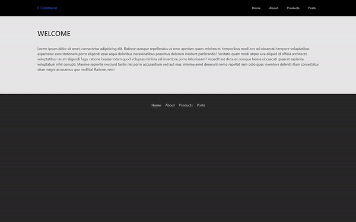

<h1> React Commerce Proje</h1>

Bu proje  React ve React Router kullanarak hazırladığım basit bir e-ticaret uygulamasıdır. Proje ürünleri listeleyen, ürün detaylarına gidilebilen, hakkında sayfası bulunan ve kullanıcı gönderilerini gösteren birkaç ana sayfadan oluşmaktadır.

<h2> Bölümler </h2>

<ul>
<li><b>Anasayfa: </b>/</li>
<li><b>Hakkında: </b>/about</li>
<li><b>Ürünler: </b>/products</li>
<li><b>Tekil Ürün: </b>/products/:productId</li>
<li><b>Gönderiler: </b>/posts</li>
<li><b>Hata Sayfası: </b>/*</li>
</ul>

<h2> Özellikler</h2>
<ul>
<li>Ürün Listeleme</li>

Ana sayfa üzerinde yer alan "Products" bağlantısına tıklandığında kullanıcıya mevcut ürünlerin listesi gösterilir. Her bir ürün, adı, detayları ve fiyatı ile birlikte kart şeklinde görüntülenir.

<li>Tekil Ürün Detayları</li>

Her bir ürün kartının üzerinde bulunan "Details" bağlantısına tıklandığında, kullanıcı ilgili ürünün detaylarını içeren özel bir sayfaya yönlendirilir. Bu sayfada ürünün büyük resmi detaylı açıklaması ve fiyatı gösterilir.

<li>Gönderi Listesi</li>

"Gönderiler" sayfasında kullanıcıya JSONPlaceholder API üzerinden alınan gönderi listesi gösterilir. Bu gönderiler kartlar halinde, başlık ve içerik bilgileriyle birlikte görüntülenir.

<li>Sayfa Yönlendirme</li>

Proje React Router kullanılarak sayfalar arasında gezinmeyi destekler. Ana sayfa, hakkında sayfası, ürünler sayfası, tekil ürün sayfası ve gönderiler sayfası gibi farklı rotalara sahiptir.

<li>Hata Sayfası</li>

Geçersiz bir sayfa yolu girildiğinde kullanıcıya özel bir hata sayfası gösterilir. Bu sayfada kullanıcı ana sayfaya geri dönmek için bir bağlantı bulabilir.

<h2> Kullanılan Teknolojiler </h2>
<ul>
<li>HTML5</li>
<li>CSS</li>
<li>React</li>
<li>React Router</li>
<li>Bootstrap</li>
<li>Axios</li>
<li>JavaScript</li>

</ul>

<h2>Ekran Görüntüsü</h2>

